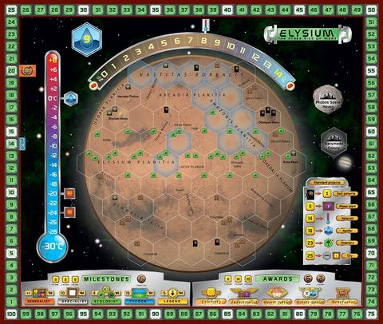

# managing-mars

This project is an upgrade to a homework assignment from bootcamp. The original assignment was about learning jQuery, and technically it met the requirements, but good grief it was ugly. No really, [take a look](https://github.com/SpiderRam/unit-4-game).

The logic is simple and the game is pretty mindless, but it is a good exercise for exploring new tech.

And I like to think my UI skills have improved.

I have worked with Vue a bit in the past, but it has been awhile and I've forgotten some things, plus there have been changes. I've also often hacked it pretty hard to accomplish whatever short term goal I had, so in this case I am trying to keep it simple and do it the right way.

Feel free to challenge my assertion that Terraforming Mars is the bomb. My cows will eat your plants.

